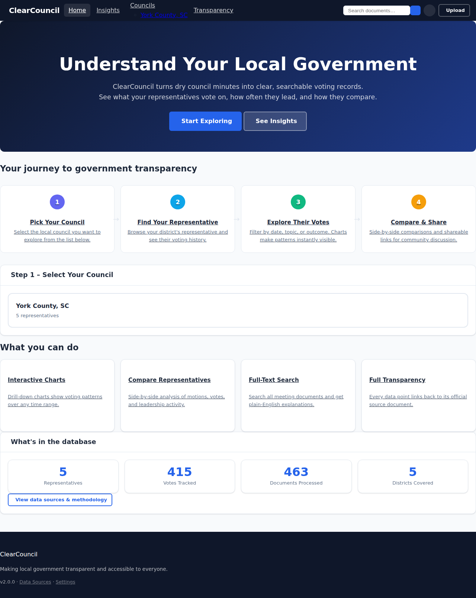
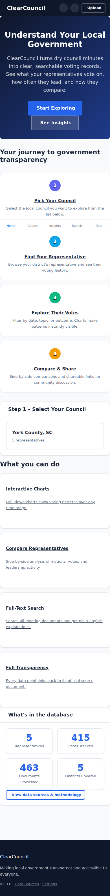

# ClearCouncil

ClearCouncil helps people understand what government is doing, why it matters, and where the evidence comes from.

Most local and state decisions are public, but not accessible. Meeting packets are long. Procurement records are scattered. Campaign finance and lobbying data are fragmented across portals. ClearCouncil turns that complexity into plain language without hiding the sources.

## Screenshots

### Home Page

The landing page guides users through a 4-step journey to government transparency, with live stats and clickable feature cards that link directly to each capability.



### Council Overview

Browse all representatives for a council, view summary stats, and quickly access key actions from a clean two-column layout.


### Mobile View

Fully responsive design with a bottom navigation bar for fast access on phones and tablets.



## Web Interface

Start the web interface with:

```bash
pip install -r requirements.txt
python clearcouncil_web.py serve --host 0.0.0.0 --port 5000
```

### Key pages

| Page | URL | Description |
|------|-----|-------------|
| Home | `/` | 4-step journey, live stats, feature cards |
| Council Overview | `/council/<id>` | Representatives list, recent meetings, activity chart |
| Representative Detail | `/representative/<id>` | Voting records, charts, date filters, CSV/HTML export |
| Compare | `/compare?council_id=<id>` | Side-by-side analysis of 2–4 representatives |
| Insights | `/insights` | Leadership rankings, consensus analysis, district breakdown |
| Transparency | `/transparency` | Data sources, processing stats, methodology |
| Search | `/search?council_id=<id>&q=…` | Full-text search of council documents |
| Upload | `/upload` | Add new PDF documents for processing |

### UI design system

All pages share a single custom CSS design system (`clearcouncil.css`) using CSS custom properties for easy theming. Dark mode is supported via Alpine.js with preference saved to `localStorage`.

Key design tokens:

```css
--cc-primary      /* brand blue #2563eb */
--cc-secondary    /* dark navy #0f172a  */
--cc-success      /* green #10b981      */
--cc-warning      /* amber #f59e0b      */
--cc-danger       /* red #ef4444        */
--cc-radius       /* 0.75rem            */
```

HTMX provides lightweight HTML-over-the-wire updates; Bootstrap 5 supplies layout utilities.

## Why this exists

A healthy democracy depends on shared facts.

Citizens should be able to answer basic questions quickly:
- What was decided this week?
- Who voted for it?
- Who benefits from the spending?
- What should be investigated further?

Journalists, watchdog groups, and public-interest teams should not have to rebuild the same data pipeline city by city.

ClearCouncil is designed to be the accountability layer for public records: source-first, explainable, and reusable.

## What ClearCouncil does

1. Collects public records from multiple government sources.
2. Extracts structured facts from agendas, minutes, votes, and documents.
3. Lets users query decisions and trends in plain language.
4. Flags patterns that may require investigation (risk indicators, not accusations).
5. Shows citations so every claim can be traced to evidence.

## New in the Next-Gen Runtime

The repository now includes a parallel, agent-first runtime under `src/clearcouncil_next/`.

- API service: `scripts/run_next_api.py`
- Autonomous worker: `scripts/run_next_worker.py`
- Local stack with PostgreSQL: `docker-compose.next.yml`
- Unattended cloud scheduling: `.github/workflows/autonomous-pipeline.yml`

### Source audit capability (new)

`POST /v1/audit/source` analyzes article text and returns:
- factual claim candidates
- explainable bias signals
- factual density and bias score
- an objective translation in plain language
- suggested investigation prompts

This is intended for triage and transparency. It should guide deeper verification, not replace reporting or legal review.

## Quick start

### Legacy mode (existing product)

```bash
pip install -r requirements.txt
python clearcouncil.py --help
python clearcouncil_web.py serve
```

### Next-gen mode (agent-first)

```bash
pip install -r requirements-next.txt
set PYTHONPATH=src
python scripts/run_next_api.py
```

In a second shell:

```bash
set PYTHONPATH=src
python scripts/run_next_worker.py
```

Run smoke tests:

```bash
set PYTHONPATH=src
python -m pytest tests/test_next_api.py -q
```

## Example: audit a news article for facts and bias cues

```bash
curl -X POST http://localhost:8080/v1/audit/source \
  -H "Content-Type: application/json" \
  -d "{\"source_name\":\"Example News\",\"article_text\":\"On February 14, 2026, the board voted 5-2 to approve a $1.2 million contract...\"}"

# Or audit directly from a URL
curl -X POST http://localhost:8080/v1/audit/source-url \
  -H "Content-Type: application/json" \
  -d "{\"source_name\":\"Example News\",\"source_url\":\"https://example.org/article\"}"
```

## Unattended cloud operation

ClearCouncil supports background, no-click execution through GitHub Actions with self-hosted runners.

Workflow: `.github/workflows/autonomous-pipeline.yml`
- scheduled runs (`cron`) for recurring ingestion/evaluation
- manual dispatch when needed
- enqueue jobs to API for worker processing

Required repository secrets:
- `CC_NEXT_API_URL`
- `CC_NEXT_API_TOKEN` (recommended)

## Privacy, PII, and security posture

ClearCouncil uses a source-safe default posture:
- secrets are not committed (`.env` is ignored)
- CI secret scanning is enabled: `.github/workflows/security-privacy-scan.yml`
- gitleaks config: `.gitleaks.toml`
- log redaction and token-safe output are built into the next-gen runtime

Important principle: publish findings as evidence-backed risk indicators, never as automatic accusations.

## Project structure (high level)

- `src/clearcouncil/` legacy CLI/web pipeline
- `src/clearcouncil_next/` next-gen API, jobs, source audit, MCP tool contracts
- `config/councils/` council onboarding configs
- `tests/` regression and integration tests
- `.github/workflows/` unattended jobs and security scans

## Roadmap direction

ClearCouncil is moving toward a reusable public accountability platform for local and state government:
- multi-source civic data ingestion
- explainable risk indicators (procurement, voting, disclosure)
- human-in-the-loop investigation queues
- plain-language public summaries with citations

See `NEXTGEN_IMPLEMENTATION.md` for current implementation status.

## Contributing

Contributions are welcome from engineers, journalists, civic technologists, and policy researchers.

Good first contributions:
- add a council/source connector
- improve extraction quality for messy documents
- expand explainable risk indicators
- improve accessibility and plain-language output

## License

ClearCouncil uses a dual-license model.

- Personal and educational use: MIT terms
- Commercial, governmental, or organizational use: separate license required

For licensing inquiries: `support@clearcouncil.org`

See `LICENSE` for full terms.


A healthy democracy depends on shared facts.

Citizens should be able to answer basic questions quickly:
- What was decided this week?
- Who voted for it?
- Who benefits from the spending?
- What should be investigated further?

Journalists, watchdog groups, and public-interest teams should not have to rebuild the same data pipeline city by city.

ClearCouncil is designed to be the accountability layer for public records: source-first, explainable, and reusable.

## What ClearCouncil does

1. Collects public records from multiple government sources.
2. Extracts structured facts from agendas, minutes, votes, and documents.
3. Lets users query decisions and trends in plain language.
4. Flags patterns that may require investigation (risk indicators, not accusations).
5. Shows citations so every claim can be traced to evidence.

## New in the Next-Gen Runtime

The repository now includes a parallel, agent-first runtime under `src/clearcouncil_next/`.

- API service: `scripts/run_next_api.py`
- Autonomous worker: `scripts/run_next_worker.py`
- Local stack with PostgreSQL: `docker-compose.next.yml`
- Unattended cloud scheduling: `.github/workflows/autonomous-pipeline.yml`

### Source audit capability (new)

`POST /v1/audit/source` analyzes article text and returns:
- factual claim candidates
- explainable bias signals
- factual density and bias score
- an objective translation in plain language
- suggested investigation prompts

This is intended for triage and transparency. It should guide deeper verification, not replace reporting or legal review.

## Quick start

### Legacy mode (existing product)

```bash
pip install -r requirements.txt
python clearcouncil.py --help
python clearcouncil_web.py serve
```

### Next-gen mode (agent-first)

```bash
pip install -r requirements-next.txt
set PYTHONPATH=src
python scripts/run_next_api.py
```

In a second shell:

```bash
set PYTHONPATH=src
python scripts/run_next_worker.py
```

Run smoke tests:

```bash
set PYTHONPATH=src
python -m pytest tests/test_next_api.py -q
```

## Example: audit a news article for facts and bias cues

```bash
curl -X POST http://localhost:8080/v1/audit/source \
  -H "Content-Type: application/json" \
  -d "{\"source_name\":\"Example News\",\"article_text\":\"On February 14, 2026, the board voted 5-2 to approve a $1.2 million contract...\"}"

# Or audit directly from a URL
curl -X POST http://localhost:8080/v1/audit/source-url \
  -H "Content-Type: application/json" \
  -d "{\"source_name\":\"Example News\",\"source_url\":\"https://example.org/article\"}"
```

## Unattended cloud operation

ClearCouncil supports background, no-click execution through GitHub Actions with self-hosted runners.

Workflow: `.github/workflows/autonomous-pipeline.yml`
- scheduled runs (`cron`) for recurring ingestion/evaluation
- manual dispatch when needed
- enqueue jobs to API for worker processing

Required repository secrets:
- `CC_NEXT_API_URL`
- `CC_NEXT_API_TOKEN` (recommended)

## Privacy, PII, and security posture

ClearCouncil uses a source-safe default posture:
- secrets are not committed (`.env` is ignored)
- CI secret scanning is enabled: `.github/workflows/security-privacy-scan.yml`
- gitleaks config: `.gitleaks.toml`
- log redaction and token-safe output are built into the next-gen runtime

Important principle: publish findings as evidence-backed risk indicators, never as automatic accusations.

## Project structure (high level)

- `src/clearcouncil/` legacy CLI/web pipeline
- `src/clearcouncil_next/` next-gen API, jobs, source audit, MCP tool contracts
- `config/councils/` council onboarding configs
- `tests/` regression and integration tests
- `.github/workflows/` unattended jobs and security scans

## Roadmap direction

ClearCouncil is moving toward a reusable public accountability platform for local and state government:
- multi-source civic data ingestion
- explainable risk indicators (procurement, voting, disclosure)
- human-in-the-loop investigation queues
- plain-language public summaries with citations

See `NEXTGEN_IMPLEMENTATION.md` for current implementation status.

## Contributing

Contributions are welcome from engineers, journalists, civic technologists, and policy researchers.

Good first contributions:
- add a council/source connector
- improve extraction quality for messy documents
- expand explainable risk indicators
- improve accessibility and plain-language output

## License

ClearCouncil uses a dual-license model.

- Personal and educational use: MIT terms
- Commercial, governmental, or organizational use: separate license required

For licensing inquiries: `support@clearcouncil.org`

See `LICENSE` for full terms.
